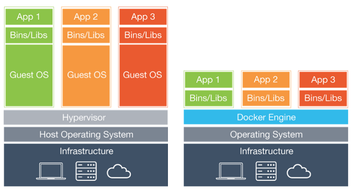

# 도커란 무엇인가?

- 컨테이너 기반 오픈소스 가상화 플랫폼
- 서버 관리 - 개발 및 서버 환경이 계속 변경됨 

## 서버관리 방식의 변화

### 전통적인 서버 관리 방식

- 유저 추가 -> 시스템 환경 변수 설정 -> 방화벽 -> 네트워크 설정 -> 의존성 관리 -> ........ -> 프록시 -> 실행

### 도커 

- 컨테이너 방식으로 프로그램을 만든다 
- 가상머신처럼 독립적으로 실행되지만 빠르고 쉽고 효율적이다

- 자원을 가상으로 분리한다 
- 컨테이너 - 격리된 환경에서 작동하는 프로세스
- 리눅스 커널의 여러 기술 활용
- 하드웨어 가상화 기술보다 가벼움 
- 이미지 단위로 프로세스 실행 환경을 구성한다 

## 도커

- 확장성과 이식성
  - 도커 존재시 어디서나 컨테이너 실행 가능
  - 특정 회사나 서비스에 종속적이지 않음
  - 개발서버를 만들 수 있고 테스트 서버 생성도 간단하다

- 표준성
  - 각 서비스들이 배포 방식이 다르나 컨테이너 표준을 사용하므로 배포 과정이 동일해진다

- 이미지
  - 이미지로 컨테이너를 생성하므로 이미지 제작 과정이 필요하다
  - `Dockerfile` 을 이용하여 이미지를 만들고 재현이 가능하다
  - 빌드 서버에서 이미지를 만들면 해당 이미지를 이미지 저장소에 저장하여 가져다 쓸 수 있다

- 설정 관리
  - 설정을 환경변수로 제어한다 

-   자원 관리
  - 컨테이너 삭제 후 새로 만들면 모든 데이터가 초기화된다
  - 업로드 파일을 외부 스토리지와 링크하여 사용하거나 S3 같은 별도 저장소 필요
  - 세션이나 캐시를 memcached나 redis 와 같은 외부로 분리한다 

- 변화
  - 클라우드 이미지 보다 관리가 쉬워졌다
  - 다른 프로세스와 격리하여 사영하지만 성능저하 거의 없다
  - 이미지 빌드 기록이 남는다

## 도커의 미래

- 컨테이너의 미래

### 쿠버네티스

- 여러 서버와 서비스를 관리하기 쉽게한다
- 스케줄링
  - 컨테이너를 적당한 서버에 배포하는 작업
  - 여러 대의 서버 중 가장 할일이 없는 서버에 배포하거나 차례대로 혹은 랜덤으로 배포한다
  - 컨테이너 개수를 늘리면 적당히 나눠 배포하고 서버가 죽으면 실행 중인 컨테이너를 다른 서버에 띄어준다

- 클러스터링
  - 여러 서버를 한 서버처럼 사용한다
  - 클러스터에는 적은 서버들부터 수천 개의 서버를 적용할 수 있다
  - 흩어져 있는 컨테이너를 가상 네트워크를 이용하여 한 서버에 있는 것처럼 통신한다

- 서비스 디스커버리
  - 서비스를 찾아주는 기능
  - 클러스터 환경에서 컨테이너는 어느 서버에 생성될지 알 수 없고 다른 서버로 이동할 수 있다
  - 따라서 컨테이너와 통신을 하기 위해서 어느 서버에 실행 중인지 파악해야 하고 컨테이너 생성되고 중지시 IP와 PORT 가 같은 정보를 업데이트해야 한다
  - key - value 스토리지에 정보를 저장할 수 있고 내부 DNS 서버를 이용한다 

